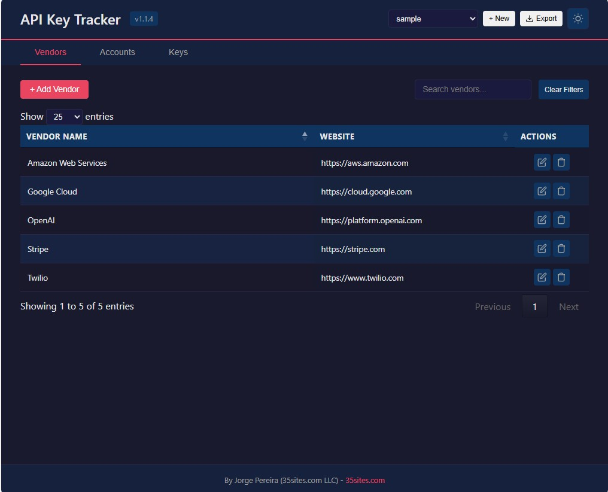
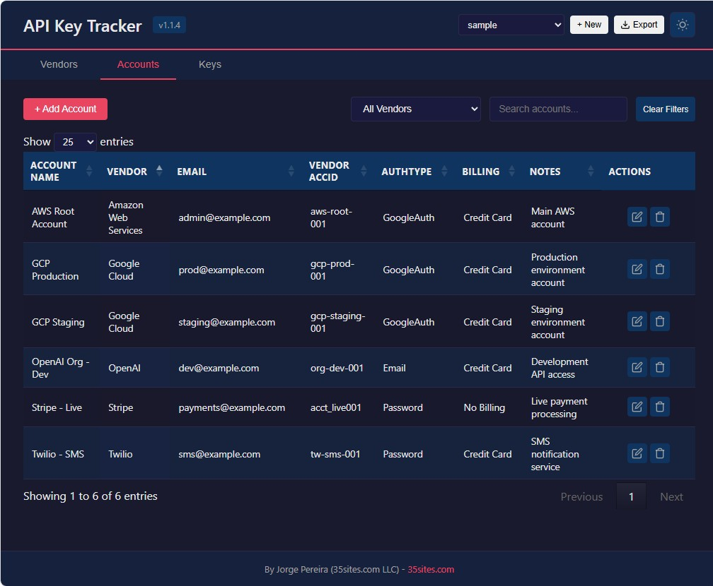
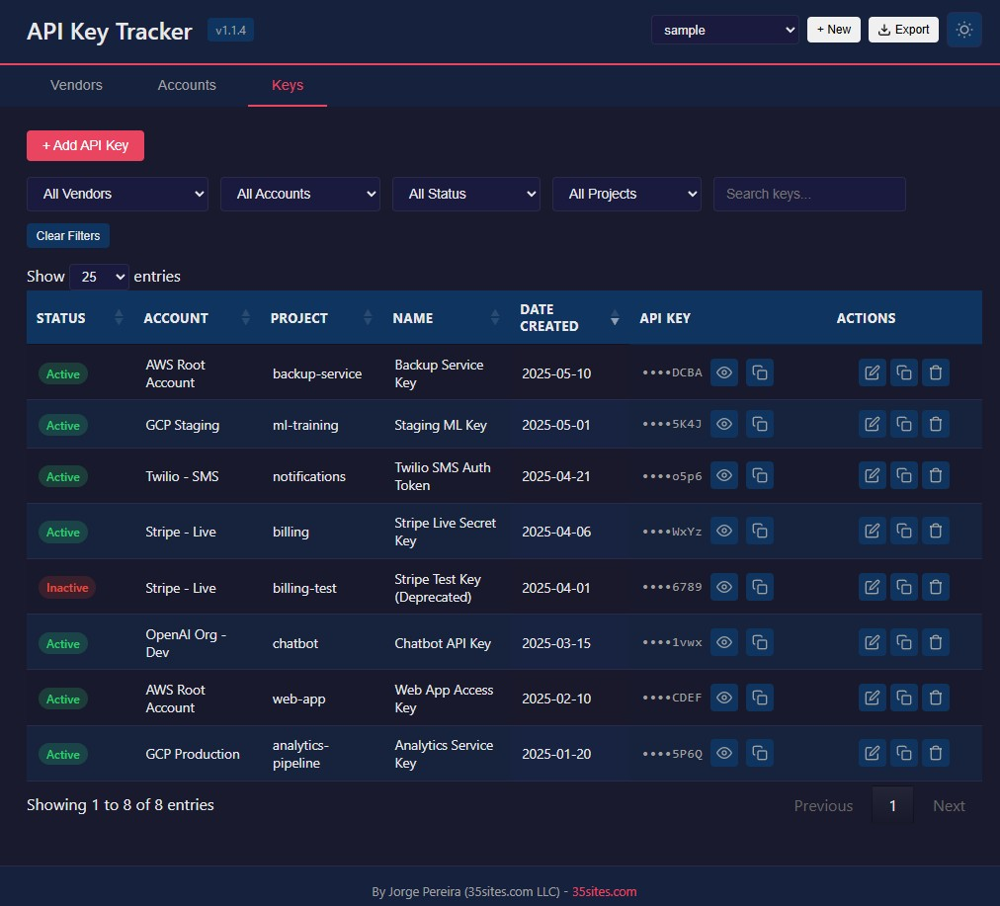
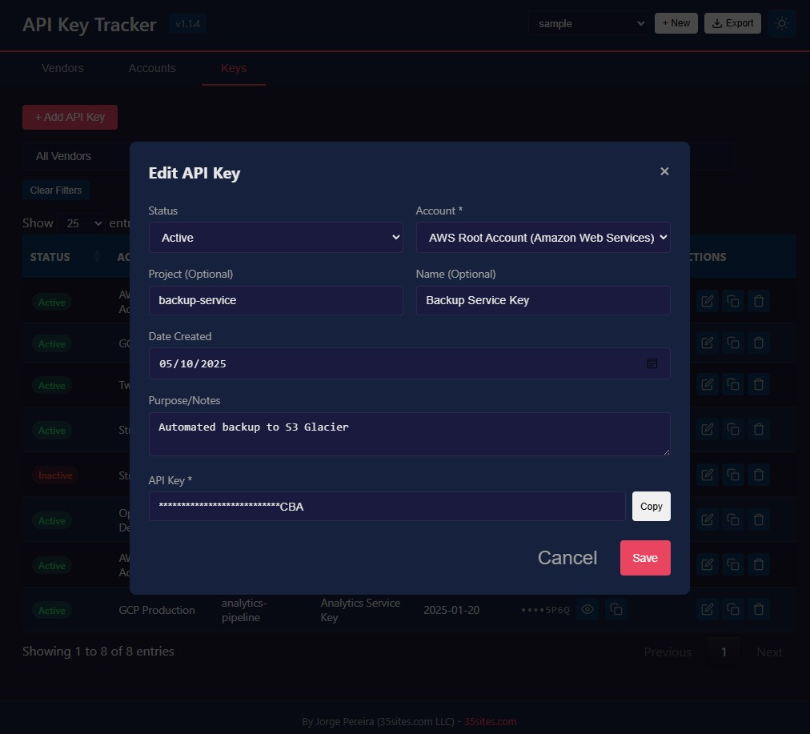

# API Key Tracker

A Node.js web application to track vendor accounts and API keys with encryption at rest.

## Version

v1.1.4

## The Problem

Managing API keys across multiple vendors, projects, and environments is a common pain point. Keys get scattered across spreadsheets, sticky notes, and plain text files. They get duplicated, lost, or worse — accidentally committed to public repositories.

**API Key Tracker** solves this by providing a centralized, secure, and easy-to-use web application that:

- Organizes your keys by **vendor → account → key** hierarchy
- Encrypts all API keys at rest using AES-256-CBC
- Keeps sensitive data out of version control
- Supports multiple isolated key files for different projects or environments

## Who Is This For?

- **Developers** who work with multiple SaaS vendors and need to track API keys
- **DevOps engineers** managing credentials across projects and environments
- **Teams** that need a shared, searchable, and secure key registry
- **Anyone** tired of losing API keys in spreadsheets or Slack messages

## Screenshots


*Vendors tab — manage your SaaS vendors*


*Accounts tab — track vendor accounts and credentials*


*Keys tab — encrypted API key management*


*Key detail view — copy and manage individual keys*

## Features

- **Three Normalized Tables**: Vendors, Accounts, and Keys — keep your data organized
- **Vendor Account Management**: CRUD operations for vendor accounts with auth type, billing setup, and notes
- **API Key Management**: Track API keys linked to accounts with status, project, name, and purpose
- **Multiple Keys Files**: Create, switch between, and manage multiple `<name>-keys.json` datasets (e.g., per project or environment)
- **Per-File Encryption**: Each keys file has its own unique AES-256-CBC encryption key
- **Search & Filter**: Full-text search across Account, Project, Name, Purpose, and Notes — plus dropdown filters by vendor, account, status, and project
- **One-Click Copy**: Copy button for all API keys with masked display by default
- **Dark/Light Theme**: Toggle between dark and light mode (top right corner)
- **Zip Export**: Export decrypted data and encryption key as a zip file for backup or migration

## Requirements

- Node.js 16 or higher
- Docker and Docker Compose (optional, for containerized deployment)

## Installation

### Local

```bash
git clone https://github.com/YOUR_USERNAME/api-key-tracker.git
cd api-key-tracker
npm install
```

### Docker

```bash
docker-compose up -d
```

## Usage

### Start the Server
```bash
node server.js
```
The application will start at http://localhost:3000

### Stop the Server
Press `Ctrl+C` in the terminal window where the server is running.

On Windows PowerShell, you can also kill the server with:
```powershell
Get-Process node | Stop-Process -Force
```

## Data Storage

### Keys Files
Data is stored in multiple keys files in the `data/` directory (e.g., `data/default-keys.json`, `data/sample-keys.json`). You can create, switch between, and manage multiple keys files from the application UI.

### Secrets File (`.secrets.json`)
The `data/.secrets.json` file stores the unique AES-256 encryption key for each keys file. It is a JSON file with the following format:

```json
{
  "ENCRYPTION_SECRET_DEFAULT": "hex_key_here",
  "ENCRYPTION_SECRET_SAMPLE": "hex_key_here",
  "ENCRYPTION_SECRET_<NAME>": "hex_key_here"
}
```

**What it does:**
- Each keys file (e.g., `default-keys.json`) has its own unique encryption key stored in `.secrets.json`
- When you create a new keys file, a new encryption key is automatically generated and saved to `.secrets.json`
- When you delete a keys file, its encryption key is removed from `.secrets.json`
- All API keys are encrypted at rest using AES-256-CBC with the file's specific key

**What it is NOT:**
- It is NOT a backup of your API keys — it only stores the encryption keys
- It does NOT contain your actual API key values

**Backup:** This file is critical. Without it, all encrypted API keys in your keys files become unrecoverable.

**Security:** The `data/` directory is excluded from git via `.gitignore`, so `.secrets.json` is never committed to version control.

**Important**: Always backup both your `.secrets.json` file and your keys files!

## Data Fields

### Vendors
- Vendor Name
- Website

### Accounts
- Account Name (auto-generated as "Vendor (email)" by default)
- Vendor (dropdown)
- Account Email
- Vendor AccID (optional)
- AuthType
- Billing Setup
- Notes

### Keys
- Status (Active/Inactive)
- Account (dropdown)
- Project (optional)
- Name (optional)
- Date Created
- Purpose/Notes
- API Key (encrypted at rest)

## Port Configuration

The application listens on port 3000 by default. This can be configured in two places:

### Local Development
Set the port in `.env`:
```
PORT=3000
```

### Docker
In `docker-compose.yml`, the `ports` mapping defines how the container port maps to your host:
```yaml
ports:
  - "3000:3000"
```
The format is `"HOST_PORT:CONTAINER_PORT"`. This forwards traffic from port 3000 on your machine to port 3000 inside the container.

The `PORT` value in `.env` (or the default 3000) must match the **container port** in the `ports` mapping. If you change `.env` to `PORT=5000`, update docker-compose to `ports: "3000:5000"` to keep it accessible at `localhost:3000`.

## Docker

### docker-compose.yml

```yaml
services:
  api-key-tracker:
    build: .
    image: api-key-tracker
    container_name: api-key-tracker
    restart: unless-stopped
    ports:
      - "3000:3000"
    env_file:
      - .env
    volumes:
      - ./data:/app/data
    networks:
      - app-network

networks:
  app-network:
    driver: bridge
```

### Start the Container
```bash
docker-compose up -d
```

### Stop the Container
```bash
docker-compose down
```

### Update (Rebuild) the Container

When you update the application code, rebuild and restart the container:

1. Stop the container:
   ```bash
   docker-compose down
   ```

2. Rebuild the image:
   ```bash
   docker-compose build --no-cache
   ```

3. Start the container:
   ```bash
   docker-compose up -d
   ```

Your data in the `data/` volume is preserved across rebuilds.

## API Endpoints

| Method | Endpoint | Description |
|--------|----------|-------------|
| GET | /api/vendors | List all vendors |
| POST | /api/vendors | Create vendor |
| PUT | /api/vendors/:id | Update vendor |
| DELETE | /api/vendors/:id | Delete vendor |
| GET | /api/accounts | List all accounts |
| POST | /api/accounts | Create account |
| PUT | /api/accounts/:id | Update account |
| DELETE | /api/accounts/:id | Delete account |
| GET | /api/keys | List all keys |
| POST | /api/keys | Create key |
| PUT | /api/keys/:id | Update key |
| DELETE | /api/keys/:id | Delete key |
| POST | /api/decrypt | Decrypt a key for display |
| GET | /api/export | Export all data (JSON) |
| POST | /api/import | Import data |
| GET | /api/export-zip | Export decrypted data + encryption key as zip |

## License

MIT

## Author

By Jorge Pereira (35sites.com LLC) - [35sites.com](https://35sites.com/)
